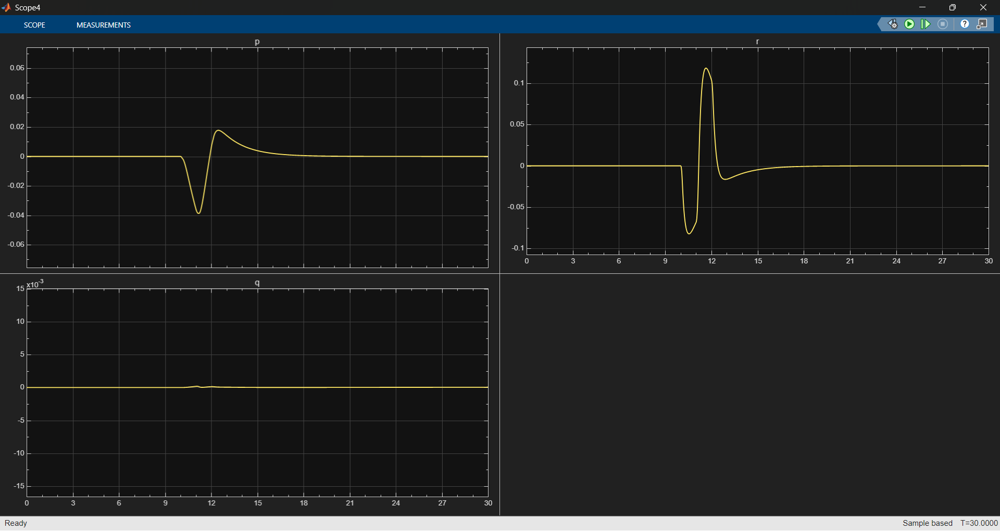

# 6DOF Fighter Aircraft Flight Control System

A complete nonlinear flight dynamics simulation with LQR-based stability augmentation system (SAS) for a fighter-class aircraft, featuring FlightGear visualization and realistic actuator dynamics.

## 🎯 Project Overview

This project implements a high-fidelity 6DOF (six degrees of freedom) flight control system for an F-16 class fighter aircraft. Building on my previous [longitudinal thrust vectoring project](https://github.com/Kumar-S-Bhat/thrust-vectoring), this system extends to full 3D flight with modern control techniques.

## ✨ Key Features

- ✅ **Nonlinear 6DOF Dynamics** - Complete equations of motion in body frame
- ✅ **Arbitrary Trim Solver** - Find equilibrium for any flight condition
- ✅ **Linearization Framework** - Extract linear models at trim points
- ✅ **LQR Controller** - Optimal state feedback for stability augmentation
- ✅ **Realistic Actuator Models** - 2nd order dynamics with rate limiting and saturation
- ✅ **FlightGear Integration** - Real-time 3D visualization
- ✅ **Disturbance Rejection** - Maintains trim under pilot commands and perturbations

## 🎬 Demonstration

The system successfully maintains trimmed flight and recovers from a rudder doublet disturbance:
- **Input:** 5.73° → -5.73° → 0° rudder deflection
- **Response:** Controller drives angular rates (p, q, r) back to zero
- **Visualization:** Real-time aircraft response in FlightGear

[](docs/FlightGear_demo.mp4)
*Roll rate (p) and yaw rate (r) response to rudder doublet - system returns to trim*
*Click image to play video (hosted in this repository)*

## 📊 System Architecture
```
Pilot Commands → [LQR Controller] → [Actuator Dynamics] → [6DOF Aircraft] 
                        ↑                                      ↓
                    [States]      ←─────────────────────────┘
```

### Control Flow
1. **Pilot Input** - pitch, yaw, roll rate commands
2. **Actuator Lag** - 2nd order transfer function with rate limits
3. **Aircraft Dynamics** - Nonlinear 6DOF equations
4. **LQR Feedback** - Optimal state correction to maintain stability
5. **FlightGear Viz** - Real-time 3D aircraft visualization

## 🔧 Technical Implementation

### Aircraft Model
- **Type:** F-16 class fighter
- **Mass:** ~9,300 kg
- **Moments of Inertia:** Full 3x3 tensor
- **Aerodynamics:** Nonlinear coefficient tables (α, β dependent)

### Control System
- **Controller:** Linear Quadratic Regulator (LQR)
- **Design Point:** Level flight trim condition
- **State Feedback:** Full 12-state vector (u, v, w, p, q, r, φ, θ, ψ, x, y, z)
- **Actuators:** 2nd order lag + rate limiting + position saturation

### Numerical Integration
- **Solver:** MATLAB/Simulink variable-step ODE solver
- **Method:** Adaptive Runge-Kutta
- **Interface:** FlightGear UDP connection for visualization

## 📂 Project Structure
```
6dof-tvc-flight-control/
├── model/
│   └── aircraft_6dof.slx          # Main Simulink model
├── scripts/
│   ├── init_workspace.m           # Initialize aircraft params
│   ├── load_aero_data.m           # Load aero data
│   ├── trim_solver.m              # Trim solver
│   ├── generate_lqr_gain.m        # LQR design
│   └── analyze_results.m          # Plot results
├── data/
│   └── lqr_gain.mat               # Generated LQR gain
├── utils/
│   └── runfg - f15.bat            # Generated LQR gain
├── docs/
│   ├── angular_rate_response.png  # Controller Response plot
│   ├── FlightGear_demo.mp4        # Controller Response video
│   └── Aircraft_image.jpg         # Cover image
├── .gitignore                     # Ignore generated files
├── .gitattributes                 # Git line endings
├── README.md                      # Project documentation
└── LICENSE                        # MIT License
```

## 🚀 Getting Started

### Prerequisites
- MATLAB R2020b or later
- Simulink
- FlightGear (optional, for visualization)

### Installation
```bash
git clone https://github.com/Kumar-S-Bhat/6dof-flight-control
cd 6dof-flight-control
```

### Running the Simulation
```matlab
% 1. Initialize Aircraft parameters
init_workspace.m

% 2. Run Simulink model
open('model/aircraft_6dof.slx')
sim('aircraft_6dof')
```

### FlightGear Visualization (Optional)
1. Launch FlightGear with UDP input enabled
2. Run Simulink model - aircraft state streams to FlightGear
3. Observe 3D visualization in real-time

## 📈 Results

### Trim Calculation
Successfully computes trimmed flight for:
- Level flight (various velocities and altitudes)
- Steady climbs/descents and Coordinated turns (coming soon)

### Disturbance Rejection
**Test Case:** Rudder doublet (5.7° → -5.7° → 0°)
- Angular rates return to zero within ~5 seconds
- Demonstrates stability augmentation effectiveness

## 🔬 Technical Details

### Linearization
State-space model extracted via numerical Jacobian:
```
ẋ = Ax + Bu
y = Cx + Du
```
where x = [u, v, w, x, y, z, p, q, r, φ, θ, ψ]ᵀ

### LQR Design
Cost function: J = ∫(xᵀQx + uᵀRu)dt
- **Q matrix:** Penalizes state deviations
- **R matrix:** Penalizes control effort
- **Solution:** Algebraic Riccati equation

### Actuator Model
2nd order transfer function:
```
         ωₙ²
G(s) = ─────────────
       s² + 2ζωₙs + ωₙ²
```
with rate limiting and saturation

## 🎓 Educational Value

This project demonstrates:
1. **Flight Dynamics** - 6DOF rigid body equations, aerodynamic modeling
2. **Control Theory** - Linearization, LQR optimal control, stability analysis
3. **Numerical Methods** - Trim solving, integration, real-time simulation
4. **Software Engineering** - Modular design, version control, documentation

## 🔜 Roadmap

### High Priority
- [ ] **Gain Scheduling** - Blend LQR controllers across flight envelope
- [ ] **Control Allocation** - Separate controller from actuator mapping
- [ ] **Autopilot Modes** - Altitude hold, heading hold, attitude command

### Future Enhancements
- [ ] Steady turn trim conditions
- [ ] Expanded flight envelope validation
- [ ] Nonlinear dynamic inversion for large maneuvers

## 📚 References

### Textbooks
- Stevens, B. L., & Lewis, F. L. (2003). *Aircraft Control and Simulation*. Wiley.
- Nelson, R. C. (1998). *Flight Stability and Automatic Control*. McGraw-Hill.

### YouTube Series
- Flight Mechanics by Christopher Lum
- Control Theory by Christopher Lum
- Aircraft Stability and Control by A.K. Ghosh IIT Kanpur
### Software
- MathWorks Aerospace Toolbox Documentation
- FlightGear Flight Simulator

## 👨‍💻 Author

**Kumar Satyanarayan Bhat**  
Aerospace Engineering Student  
Indian Institute of Engineering Science and Technology, Shibpur

**LinkedIn:** [linkedin.com/in/kumar-bhat-6337a7332](https://www.linkedin.com/in/kumar-bhat-6337a7332/)  
**GitHub:** [github.com/Kumar-S-Bhat](https://github.com/Kumar-S-Bhat)

## 📄 License

MIT License - See [LICENSE](LICENSE) file for details.

## 🙏 Acknowledgments

- Aircraft parameters based on publicly available F-16 data
- Control architecture inspired by modern fighter flight control systems
- Built upon knowledge from my previous [thrust vectoring project](https://github.com/Kumar-S-Bhat/thrust-vectoring)
- Project developed as part of aerospace engineering coursework